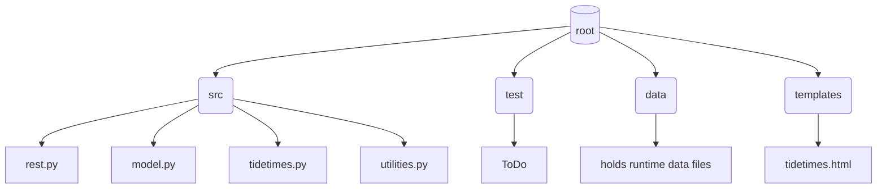

##### See https://mermaid-js.github.io/mermaid/#/flowchart and other pointers on that site

```mermaid
  graph TD
    R[(root)] --> S1(src)
    R --> T1(test)
    R --> D1(data)
    R --> Tp1(templates)
    S1 --> C1[rest.py]
    S1 --> C2[model.py]
    S1 --> C3[tidetimes.py]
    S1 --> C4[utilities.py]
    T1 --> ToDo
    D1 --> D2[holds runtime data files]
    Tp1 --> TpTT[tidetimes.html]
``` 
