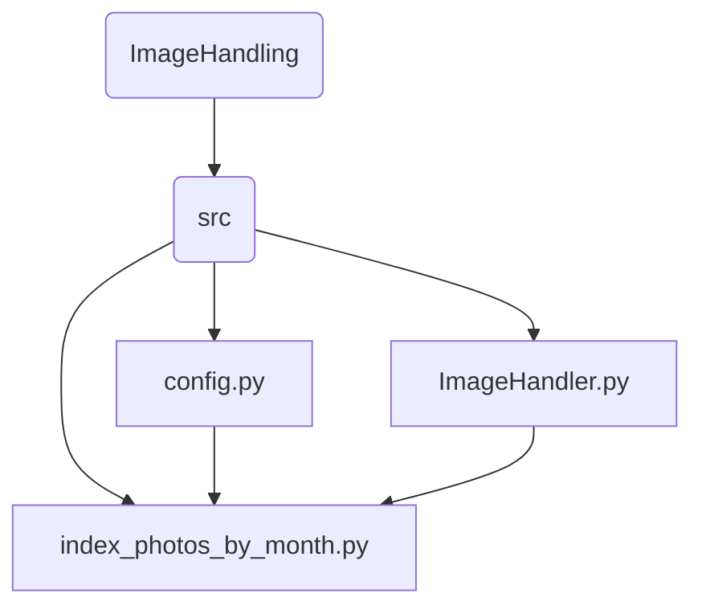

<h1>"Mark" photo indexer</h1>
The user's entry point is <code>index_photos_by_month.py</code> .

Perhaps as a 1-off, the user will also edit <code>config.py</code>, which records the source (where the original photos are to be found) and target (where the copied/converted photos are to be saved) folders, and removes the need for the user to enter run-time parameters.

The full command for <code>index_photos_by_month.py</code> is   
<code> python.exe index_photos_by_month.py</code>  
, and indeed even that assumes that (a) python is on the path, and (b) python.exe is the name of the python executable, as this differs between OSes.

You start <code>index_photos_by_month.py</code>. This pulls in the configuration data from <code>config.py</code>, and imports <code>ImageHandler.py</code>. This latter file holds all of the functionality. <code>index_photos_by_month.py</code>, is "just" the route into the stuff inside <code>ImageHandler.py</code>.

