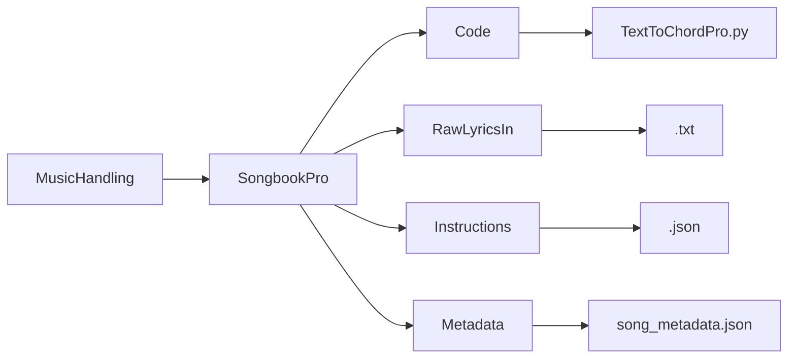

# SongbookPro Converter

This project:
- converts chord and lyric files in UltimateGuitar format into [ChordPro](https://www.chordpro.org/chordpro/) format, suitable for use with SongBookPro
- consolidates song metadata from individual JSON files into a single `song_metadata.json` file
- converts ChordPro files to UltimateGuitar format, in case the original UltimateGuitar format has been lost

## Features

- **Chord and Lyric Merging:**  
  - Aligns chords above lyrics and merges them into ChordPro format.
  - Performs the reverse operation, converting ChordPro files back to UltimateGuitar format.
- **Section Header Recognition:**  
  Detects and standardizes section headers (e.g., `[Verse]`, `[Chorus]`, `[Bridge]`).
- **Metadata Consolidation:**  
  Combines individual song metadata JSON files into one file, adding a `title` attribute based on the filename.
- **CamelCase Title Formatting:**  
  Converts filenames like `ASongByMe` to readable titles like `A Song By Me`, unless the title already contains spaces.
- **Batch Processing:**  
  Processes all `.txt` files in the `RawLyricsIn` folder.

## Folder Structure



## Usage

1. **Prepare your files:**

   - Place your chord/lyric `.txt` files in `RawLyricsIn/`.
   - Place your individual song metadata `.json` files in `Metadata/`.

2. **Consolidate metadata:**

   - Run the metadata consolidation script to create `song_metadata.json` in the `Metadata/` folder.

3. **Convert songs:**
   - Run `TextToChordPro.py`.  
     By default, it processes all songs in `RawLyricsIn/` using metadata from `Metadata/song_metadata.json`.

## Example

```python
# Convert all songs in RawLyricsIn/
if __name__ == "__main__":
    process_all_songs()

```

## Key Functions
- `merge_chords_and_lyrics(chord_line, lyric_line)`:  
Merges chords and lyrics into ChordPro format.  
- `process_multiline_text(input_text)`:  
Processes multiline text, handling section headers and merging lines.  
- `process_song(song)`:  
Converts a single song using metadata from song_metadata.json.  
- `process_all_songs()`:  
Batch processes all songs in the lyrics folder.  

## Metadata Format
Each song entry in `song_metadata.json` includes:

```json
{
  "title": "A Song By Me",
  "artist": "Artist Name",
  "key-original": "C",
  "key-me": "C",
  "capo": 0,
  "tempo": 88,
  "output_folder": "ChordPro"
}
```

## Notes
- Section headers like [Verse] and [Chorus] are standardized.
- Titles are formatted for readability.
- Output files are saved in the specified output folder in ChordPro format.