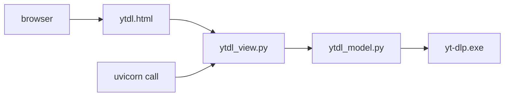

# GUI for Youtube Downloader
* What: A video downloader
* How:  A GUI-based wrapper to the excellent yt-dlp utility

## Motivation

* **As** a viewer of community videos 
* **I want** a download utility [1] 
* With a user interface that allows me to focus on the important points [2]
* And which has sensible defaults for options that I don't need to change [3]
* **So that** I can spend more time downloading and viewing
* And less time fighting with the command line  

###### [1] This is [yt-dlp](https://github.com/yt-dlp/yt-dlp#readme), of course. It is an excellent utility, and in doing...  
###### [2] my sad little GUI, I am taking liberties with the shoulders of giants. Certainly there are other wrappers out there, with better coding than mine, but this gave me a chance to practise a number of languages in a small way that is useful to me. 
###### [3] Really, all I want to change between runs is the video id. OK, there are options for sub-folders to save to, and to save a list of videos (this right now 03.2022 a bit iffy), but if you took those options away, I would still be happy

<hr/>

## 1. Usage
As you will need to do setup before you can use this wrapper, this may seem the wrong sequence. However, I figured that first reading how you use it, would help you decide whether it was for you, before moving on to setup.  

<hr/>

### 1.1 Start the Uvicorn server 

  
<hr/>

### 1.2 Open a browser at http://127.0.0.1:8000/video  


<hr/>

### 1.3 Choose Youtube video or Tiktok video


<hr/>

### 1.4 Enter a video id (expand Click for Help for more on this)

*Note that the video id ```FFs4JIUbXJU``` can be used for testing Youtube: I wrote it, so no copyright issues, and it is only a few mb.*


<hr/>

### 1.5 Click [Save]


<hr/>

### 1.6 After a few seconds (assuming a file size of less than say 1gb), the download location is confirmed:


<hr/>

### 1.7 And from there you can play the mp4:


<hr/>

### 1.8 As mentioned above, expanding Click for Help gives some more detail:


<hr/>

## 2. Setup
### 2.1 Pre-requisites  
**2.1.1 Server**  
* Windows - _todo - make it Windows/Linux agnostic_  
* Python3    
* clone the parent repo of this readme
* ```pip install ‑r requirements.txt``` - preferably into a virtualenv  
  * If you have a virtual env, then if in PowerShell, you can...
    *  cd D:\Sandbox\git\aadennis
    *  . ./virtualenvs/venv/Scripts/activate
* ```cd (your working root - the root of this repo)  ```
* ```cd .\PythonSandboxAA\VideoHandling\Downloader  ```
* ```uvicorn src.ytdl_view:app --reload ``` 

**2.1.2 Browser**  
http://127.0.0.1:8000/video  

If all of that is successful, you will see this or similar in your server log:    

  

and this in your browser:  
  

## 3. Item dependencies

* "Item" is used very loosely, simply to convey dependencies.  
  * It can be a browser, a binary executable, a Python Module, and so on.  
* Convention: the item on the left-hand side, or source, of the arrow depends on the item on the right-hand side, or target. 
  * As an example, ```ytdl_model.py``` depends on ```yt-dlp.exe```.
  * <small> (I would have preferred a top down dependency shape, but cannot get that right now in Mermaid. But just having Mermaid at all is great - thank you Git Engineering!)</small>



## 4. Tests  
* No automated tests yet.
* For manual testing, note that the video id ```FFs4JIUbXJU``` can be used for testing: I wrote it, so no copyright issues, and it is only a few mb.
## 5. Performance notes
* todo
## 6. Language stack
* Python 3
* FastApi
  * Jinja2 templating
* Uvicorn
* HTML
  * BootStrap
* JavaScript


