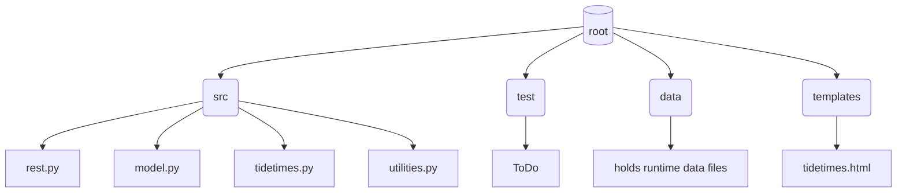

### some stuff
https://github.com/mermaid-js/mermaid-cli
cd 'C:\Program Files\nodejs'
npm install @mermaid-js/mermaid-cli
 ./node_modules/.bin/mmdc -i C:\temp\diagram.md -o c:\temp\xdiagram.md
Found 1 mermaid charts in Markdown input
c:\temp\xdiagram-1.svg
c:\temp\xdiagram.md 

